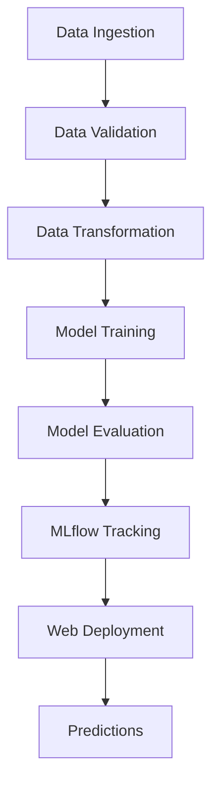

# 🍷 Wine Quality Prediction - End-to-End ML Pipeline

A production-ready machine learning system for predicting wine quality based on physicochemical properties. This project implements a complete, industry-standard data science workflow from data ingestion to web deployment.


---

## 📋 Table of Contents

- [Overview](#-overview)
- [Features](#-features)
- [Live Demo](#-live-demo)
- [Project Structure](#-project-structure)
- [Installation](#-installation)
- [Configuration](#-configuration)
- [Usage](#-usage)
- [ML Pipeline Stages](#-ml-pipeline-stages)
- [Model Information](#-model-information)
- [Web Application](#-web-application)
- [Docker Deployment](#-docker-deployment)
- [Technologies Used](#-technologies-used)
- [Project Workflow](#-project-workflow)
- [Logging & Monitoring](#-logging--monitoring)
- [Contributing](#-contributing)
- [License](#-license)

---

## 🎯 Overview

This project demonstrates a **production-grade ML pipeline** following industry best practices for end-to-end machine learning systems. It automates the entire data science workflow including:

- **Data Ingestion** - Automated data download and extraction
- **Data Validation** - Schema validation and data quality checks
- **Data Transformation** - Preprocessing and train-test splitting
- **Model Training** - ElasticNet regression with hyperparameter tuning
- **Model Evaluation** - Performance metrics tracking with MLflow
- **Prediction API** - Flask-based web application for real-time predictions

The pipeline is designed to be **modular, configurable, and deployable** across different environments.

---

## ✨ Features

### Pipeline Features
- ✅ **Automated ML Pipeline** - Complete end-to-end workflow execution
- ✅ **Data Validation** - Schema enforcement and data quality checks
- ✅ **Configuration Management** - YAML-based configuration for easy customization
- ✅ **Modular Architecture** - Clean separation of concerns with reusable components
- ✅ **Comprehensive Logging** - File-based logging for monitoring and debugging
- ✅ **Experiment Tracking** - MLflow integration for model performance tracking
- ✅ **DagsHub Integration** - Remote experiment tracking and visualization

### Application Features
- ✅ **Web Interface** - Beautiful, responsive UI for predictions
- ✅ **REST API** - Flask-based prediction endpoints
- ✅ **Real-time Predictions** - Instant wine quality predictions
- ✅ **Docker Support** - Containerized deployment for consistency

---

## 🌐 Live Demo

Access the web application:
- **Local**: `http://localhost:8080`
- **Production**: [Deploy on Render](https://render.com)

---

## 📁 Project Structure

```
machine_learning_project1/
├── .github/                    # GitHub workflows (CI/CD)
├── artifacts/                  # Pipeline outputs
│   ├── data_ingestion/         # Downloaded and extracted data
│   ├── data_validation/        # Validation status files
│   ├── data_transformation/    # Processed train/test data
│   ├── model_trainer/          # Trained model artifacts
│   └── model_evaluation/       # Metrics and evaluation results
├── config/
│   └── config.yaml             # Main configuration file
├── logs/                       # Application logs
├── research/                   # Jupyter notebooks and experiments
├── src/
│   └── datascience/
│       ├── components/         # Pipeline components
│       │   ├── data_ingestion.py
│       │   ├── data_validation.py
│       │   ├── data_transformation.py
│       │   ├── model_trainer.py
│       │   └── model_evaluation.py
│       ├── config/             # Configuration managers
│       ├── entity/             # Data entities (config_entity.py)
│       ├── pipeline/           # Pipeline implementations
│       │   ├── data_ingestion_pipeline.py
│       │   ├── data_validation_pipeline.py
│       │   ├── data_transformation_pipeline.py
│       │   ├── model_trainer_pipeline.py
│       │   ├── model_evaluation_pipeline.py
│       │   └── prediction_pipeline.py
│       ├── utils/              # Utility functions
│       ├── constants/          # Constants
│       └── __init__.py         # Logger initialization
├── templates/                  # HTML templates
│   ├── index.html              # Home page
│   └── results.html            # Prediction results
├── .env                        # Environment variables (credentials)
├── .gitignore                  # Git ignore rules
├── app.py                      # Flask web application
├── main.py                     # Main pipeline entry point
├── params.yaml                 # Model hyperparameters
├── schema.yaml                 # Data schema definitions
├── requirements.txt            # Python dependencies
├── setup.py                    # Package setup
└── Dockerfile                  # Docker configuration
```

---

## 🚀 Installation

### Prerequisites

- Python 3.8 or higher
- pip (Python package manager)
- Git

### Step-by-Step Installation

1. **Clone the repository**
   ```bash
   git clone https://github.com/rizwanahmed1981/machine_learning_project1.git
   cd machine_learning_project1
   ```

2. **Create a virtual environment**
   ```bash
   python -m venv venv
   ```

3. **Activate the virtual environment**
   - **Windows:**
     ```bash
     venv\Scripts\activate
     ```
   - **Linux/Mac:**
     ```bash
     source venv/bin/activate
     ```

4. **Install dependencies**
   ```bash
   pip install -r requirements.txt
   ```

5. **Create environment file** (for MLflow tracking)
   
   Create a `.env` file in the project root:
   ```bash
   # MLflow Tracking Configuration
   MLFLOW_TRACKING_URI=https://dagshub.com/YOUR_USERNAME/YOUR_REPO.mlflow
   MLFLOW_TRACKING_USERNAME=your_username
   MLFLOW_TRACKING_PASSWORD=your_access_token
   ```

   > **Note:** Get your DagsHub access token from [DagsHub Settings](https://dagshub.com/user/settings/tokens)

---

## ⚙️ Configuration

The project uses three main configuration files:

### `config.yaml` - Main Configuration
Controls artifact directories, data URLs, and file paths:
```yaml
artifacts_root: artifacts

data_ingestion:
  root_dir: artifacts/data_ingestion
  source_URL: <dataset_url>
  local_data_file: artifacts/data_ingestion/data.zip
  unzip_dir: artifacts/data_ingestion

data_validation:
  root_dir: artifacts/data_validation
  STATUS_FILE: artifacts/data_validation/status.txt

# ... (similar sections for transformation, training, evaluation)
```

### `schema.yaml` - Data Schema
Defines expected columns and data types:
```yaml
COLUMNS:
  fixed acidity: float64
  volatile acidity: float64
  # ... other columns
  quality: int64

TARGET_COLUMN:
  name: quality
```

### `params.yaml` - Model Hyperparameters
Configures model training parameters:
```yaml
ElasticNet:
  alpha: 0.2
  l1_ratio: 0.1
```

---

## 📖 Usage

### Run the Complete ML Pipeline

Execute all pipeline stages:
```bash
python main.py
```

This runs the following stages sequentially:
1. Data Ingestion
2. Data Validation
3. Data Transformation
4. Model Training
5. Model Evaluation

### Run Individual Pipeline Stages

You can run individual stages by importing them in Python:

```python
from src.datascience.pipeline.data_ingestion_pipeline import DataIngestionTrainingPipeline

pipeline = DataIngestionTrainingPipeline()
pipeline.initiate_data_ingestion()
```

### Start the Web Application

Launch the Flask prediction server:
```bash
python app.py
```

Access the application at: `http://localhost:8080`

---

## 🔧 ML Pipeline Stages

### 1. Data Ingestion
**Purpose:** Download and extract the dataset

**What it does:**
- Downloads wine quality dataset from GitHub
- Extracts ZIP archive
- Stores data in `artifacts/data_ingestion/`

**Output:** `winequality-red.csv`

---

### 2. Data Validation
**Purpose:** Ensure data quality and schema compliance

**What it does:**
- Loads the CSV data
- Validates column names against schema
- Checks data types
- Writes validation status to file

**Output:** `artifacts/data_validation/status.txt`

---

### 3. Data Transformation
**Purpose:** Preprocess data for training

**What it does:**
- Loads validated data
- Performs train-test split (75-25)
- Saves processed datasets

**Output:**
- `artifacts/data_transformation/train.csv`
- `artifacts/data_transformation/test.csv`

---

### 4. Model Training
**Purpose:** Train the ElasticNet regression model

**What it does:**
- Loads training data
- Separates features and target
- Trains ElasticNet with configured hyperparameters
- Serializes model using joblib

**Output:** `artifacts/model_trainer/model.joblib`

---

### 5. Model Evaluation
**Purpose:** Evaluate model performance and track metrics

**What it does:**
- Loads test data and trained model
- Calculates metrics (RMSE, MAE, R²)
- Logs metrics to MLflow/DagsHub
- Saves metrics to JSON file

**Output:** `artifacts/model_evaluation/metrics.json`

**Metrics Tracked:**
- **RMSE** (Root Mean Squared Error)
- **MAE** (Mean Absolute Error)
- **R²** (Coefficient of Determination)

---

## 🤖 Model Information

### Algorithm: ElasticNet Regression

**Why ElasticNet?**
- Combines L1 (Lasso) and L2 (Ridge) regularization
- Handles multicollinearity in features
- Prevents overfitting
- Good for datasets with correlated features

**Hyperparameters:**
| Parameter | Value | Description |
|-----------|-------|-------------|
| `alpha` | 0.2 | Regularization strength |
| `l1_ratio` | 0.1 | L1 regularization ratio |
| `random_state` | 42 | Reproducibility seed |

**Performance Metrics:**
| Metric | Value |
|--------|-------|
| RMSE | ~0.68 |
| MAE | ~0.53 |
| R² | ~0.26 |

---

## 🌐 Web Application

### Endpoints

| Endpoint | Method | Description |
|----------|--------|-------------|
| `/` | GET | Home page with input form |
| `/predict` | POST | Submit features for prediction |
| `/train` | GET | Trigger pipeline retraining |

### Input Features

The web form accepts 11 physicochemical properties:

| Feature | Description | Example Value |
|---------|-------------|---------------|
| Fixed Acidity | Total acidity | 7.4 |
| Volatile Acidity | Acetic acid content | 0.70 |
| Citric Acid | Citric acid content | 0.00 |
| Residual Sugar | Sugar after fermentation | 1.9 |
| Chlorides | Salt content | 0.076 |
| Free Sulfur Dioxide | Free SO₂ | 11.0 |
| Total Sulfur Dioxide | Total SO₂ | 34.0 |
| Density | Wine density | 0.9978 |
| pH | Acidity/alkalinity | 3.51 |
| Sulphates | Potassium sulphate | 0.56 |
| Alcohol | Alcohol percentage | 9.4 |

---

## 🐳 Docker Deployment

### Build the Docker Image

```bash
docker build -t wine-quality-ml .
```

### Run the Container

```bash
docker run -p 8080:8080 wine-quality-ml
```

### Deploy to Cloud

**Render.com:**
1. Push code to GitHub
2. Connect repository to Render
3. Configure build command: `pip install -r requirements.txt`
4. Configure start command: `python app.py`

**DagsHub MLflow:**
- View experiments: `https://dagshub.com/rizwanahmed1981/machine_learning_project1.mlflow`

---

## 🛠 Technologies Used

| Category | Technology | Purpose |
|----------|------------|---------|
| **Language** | Python 3.8+ | Core programming |
| **ML Framework** | scikit-learn | Machine learning algorithms |
| **Data Processing** | pandas, NumPy | Data manipulation |
| **Visualization** | Matplotlib | Data visualization |
| **Experiment Tracking** | MLflow | Metrics and model tracking |
| **Remote Tracking** | DagsHub | Cloud MLflow hosting |
| **Web Framework** | Flask | REST API and web UI |
| **Configuration** | PyYAML | YAML configuration parsing |
| **Model Serialization** | joblib | Model persistence |
| **Containerization** | Docker | Deployment consistency |
| **Environment** | python-dotenv | Environment variable management |
| **Utilities** | python-box, tqdm, ensure | Data handling and progress tracking |

---

## 📊 Project Workflow



### Development Workflow

1. **Update Configuration**
   - Modify `config.yaml` for paths/URLs
   - Update `schema.yaml` for data structure
   - Adjust `params.yaml` for hyperparameters

2. **Update Code**
   - Modify entities in `src/datascience/entity/`
   - Update components in `src/datascience/components/`
   - Update pipelines in `src/datascience/pipeline/`

3. **Test Pipeline**
   ```bash
   python main.py
   ```

4. **Deploy**
   ```bash
   python app.py
   ```

---

## 📝 Logging & Monitoring

### Log Files

Logs are stored in `logs/` directory with timestamps:
```
logs/log_2026-03-07_01-16-27.log
```

### Log Levels
- **INFO** - Pipeline stage progress
- **ERROR** - Exceptions and failures
- **DEBUG** - Detailed execution info

### MLflow Dashboard

Track experiments on DagsHub:
```
https://dagshub.com/rizwanahmed1981/machine_learning_project1.mlflow
```

Features:
- Run comparison
- Metric visualization
- Model registry
- Artifact storage

---

## 🧪 Testing

### Test the Pipeline

```bash
# Run full pipeline
python main.py

# Check artifacts
ls artifacts/

# View logs
cat logs/*.log
```

### Test Predictions

```bash
# Start the app
python app.py

# Send prediction request (using curl)
curl -X POST http://localhost:8080/predict \
  -d "fixed_acidity=7.4&volatile_acidity=0.70&citric_acid=0.00&residual_sugar=1.9&chlorides=0.076&free_sulfur_dioxide=11.0&total_sulfur_dioxide=34.0&density=0.9978&pH=3.51&sulphates=0.56&alcohol=9.4"
```

---

## 🤝 Contributing

Contributions are welcome! Please follow these steps:

1. **Fork the repository**
2. **Create a feature branch**
   ```bash
   git checkout -b feature/amazing-feature
   ```
3. **Commit your changes**
   ```bash
   git commit -m "Add amazing feature"
   ```
4. **Push to the branch**
   ```bash
   git push origin feature/amazing-feature
   ```
5. **Open a Pull Request**

### Code Style
- Follow PEP 8 guidelines
- Use type hints where applicable
- Add docstrings to functions
- Write meaningful commit messages

---

## 📄 License

This project is licensed under the MIT License - see the [LICENSE](LICENSE) file for details.

---

## 📧 Contact & Support

- **Repository:** [github.com/rizwanahmed1981/machine_learning_project1](https://github.com/rizwanahmed1981/machine_learning_project1)
- **Issues:** [Open an issue](https://github.com/rizwanahmed1981/machine_learning_project1/issues)
- **MLflow Dashboard:** [DagsHub MLflow](https://dagshub.com/rizwanahmed1981/machine_learning_project1.mlflow)

---

## 🙏 Acknowledgments

- **Dataset:** [UCI Machine Learning Repository - Wine Quality](https://archive.ics.uci.edu/ml/datasets/wine+quality)
- **MLflow:** [MLflow Documentation](https://mlflow.org/docs/latest/index.html)
- **DagsHub:** [DagsHub Platform](https://dagshub.com)

---

<div align="center">

**Made with ❤️ for wine enthusiasts and data scientists**

⭐ Star this repo if you find it helpful!

</div>
